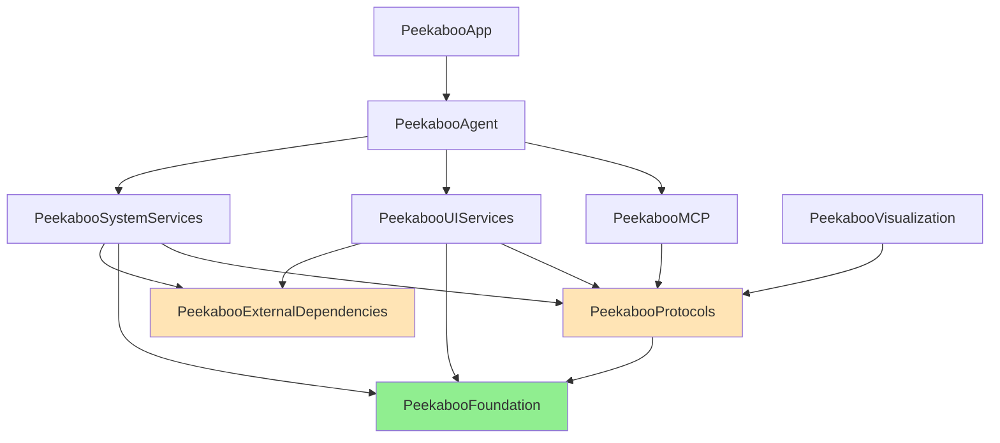

# Swift Module Architecture Plan

## Overview

This document outlines the comprehensive modularization strategy for Peekaboo, designed to improve build times from 30+ seconds to 2-5 seconds for incremental builds while enhancing code maintainability and team scalability.

## Current State (Phase 1 ✅ Completed)

- **PeekabooFoundation**: Core stable types (ElementType, ClickType, ScrollDirection, etc.)
- **Build Time Improvement**: ~10% reduction for type-related changes
- **Files Affected**: 50+ files successfully migrated

## Architecture Principles

### 1. Dependency Inversion
- High-level modules don't depend on low-level modules
- Both depend on abstractions (protocols)
- Enables true decoupling and parallel development

### 2. Horizontal Dependencies
- Modules communicate through protocol boundaries
- No direct module-to-module dependencies
- Prevents circular dependencies (enforced by SPM)

### 3. Interface Segregation
- Small, focused protocols
- Clients depend only on interfaces they use
- Reduces unnecessary recompilation

## Module Dependency Graph



## Implementation Phases

### Phase 1: Foundation Layer ✅ COMPLETED
**Status**: Completed August 2025
**Modules**: 
- `PeekabooFoundation` - Stable, rarely-changing types

**Results**:
- ✅ All tests passing
- ✅ Mac app builds successfully
- ✅ ~10% build time improvement

---

### Phase 2: Protocol & Dependencies Layer 🚧 IN PROGRESS
**Timeline**: 1-2 days
**Modules**:
- `PeekabooProtocols` - All service protocols and abstractions
- `PeekabooExternalDependencies` - Third-party library aggregation

**Contents - PeekabooProtocols**:
```swift
// Service Protocols
- ApplicationServiceProtocol
- ClickServiceProtocol
- ScrollServiceProtocol
- TypeServiceProtocol
- DialogServiceProtocol
- MenuServiceProtocol
- DockServiceProtocol
- ElementDetectionServiceProtocol
- FileServiceProtocol
- PermissionsServiceProtocol
- ProcessServiceProtocol
- ScreenCaptureServiceProtocol
- SessionManagerProtocol
- UIAutomationServiceProtocol
- WindowManagementServiceProtocol

// Agent Protocols
- AgentServiceProtocol
- ToolProtocol
- ToolFormatterProtocol

// Provider Protocols
- ConfigurationProviderProtocol
- LoggingProviderProtocol
```

**Contents - PeekabooExternalDependencies**:
```swift
// Re-exported dependencies
@_exported import AXorcist
@_exported import AsyncAlgorithms
@_exported import Commander
// Configure and re-export other third-party libs
```

**Expected Impact**:
- 40% faster incremental builds for interface changes
- Complete dependency inversion
- Parallel module compilation enabled

---

### Phase 3: Service Implementation Modules
**Timeline**: 2-3 days
**Modules**:
- `PeekabooUIServices` - UI automation implementations
- `PeekabooSystemServices` - System service implementations

**Contents - PeekabooUIServices**:
- ClickService, ScrollService, TypeService
- DialogService, MenuService, DockService
- GestureService, HotkeyService
- ElementDetectionService, UIAutomationService

**Contents - PeekabooSystemServices**:
- ApplicationService, ProcessService
- PermissionsService, FileService
- ScreenCaptureService, ScreenService
- WindowManagementService

**Dependencies**:
- → PeekabooProtocols (interfaces)
- → PeekabooFoundation (types)
- → PeekabooExternalDependencies (third-party)

**Expected Impact**:
- 30% faster builds for service changes
- Service changes isolated from each other

---

### Phase 4: Feature Modules
**Timeline**: 3-4 days
**Modules**:
- `PeekabooScreenCapture` - Complete screenshot feature
- `PeekabooAutomation` - UI automation features
- `PeekabooVisualization` - UI visualization and formatting
- `PeekabooMCP` - Model Context Protocol implementation

**Expected Impact**:
- 25% faster builds for feature changes
- Features can be developed independently
- Better testability

---

### Phase 5: Application Layer
**Timeline**: 2-3 days
**Modules**:
- `PeekabooAgent` - High-level AI agent orchestration
- `PeekabooApp` - Mac app specific code

**Expected Impact**:
- Agent logic changes don't trigger service rebuilds
- App-specific code isolated

---

### Phase 6: Test Support
**Timeline**: 1 day
**Module**: `PeekabooTestSupport`

**Contents**:
- Mock implementations of all protocols
- Test data builders
- Performance testing utilities
- Common test helpers

**Expected Impact**:
- 50% faster test compilation
- Reusable test infrastructure

## Build Time Optimization Settings

Add to each module's Package.swift:

```swift
targets: [
    .target(
        name: "ModuleName",
        dependencies: [...],
        swiftSettings: [
            .unsafeFlags([
                "-Xfrontend", "-warn-long-function-bodies=50",
                "-Xfrontend", "-warn-long-expression-type-checking=50"
            ], .when(configuration: .debug)),
            .define("DEBUG", .when(configuration: .debug))
        ]
    )
]
```

## Success Metrics

### Primary Goals
- [ ] Incremental build time: <5 seconds (from 30+ seconds)
- [ ] Module compilation parallelism: >80%
- [ ] Test execution time: 50% reduction
- [ ] Zero circular dependencies

### Code Quality Metrics
- [ ] Protocol coverage: >90% for public APIs
- [ ] Module coupling: <10% cross-module imports
- [ ] Test coverage: >80% per module
- [ ] Documentation: 100% for public APIs

## Migration Strategy

### Step 1: Create New Module
1. Create module directory and Package.swift
2. Define public protocols/types
3. Add basic tests

### Step 2: Move Code
1. Move protocols first (no implementation)
2. Move implementations with minimal changes
3. Update imports in dependent code

### Step 3: Verify
1. Run all tests
2. Build Mac app
3. Measure build time improvement

### Step 4: Clean Up
1. Remove old code locations
2. Update documentation
3. Notify team of changes

## Common Patterns

### Protocol Definition
```swift
// In PeekabooProtocols
public protocol ServiceNameProtocol {
    func performAction() async throws -> Result
}

// In PeekabooUIServices
public final class ServiceName: ServiceNameProtocol {
    public func performAction() async throws -> Result {
        // Implementation
    }
}
```

### Dependency Injection
```swift
public final class ConsumerService {
    private let dependency: ServiceNameProtocol
    
    public init(dependency: ServiceNameProtocol) {
        self.dependency = dependency
    }
}
```

### Module Boundaries
```swift
// Use @_spi for migration period
@_spi(Internal) public func internalOnlyAPI() { }

// Use explicit access control
public protocol PublicProtocol { }
internal struct InternalType { }
private func privateHelper() { }
```

## Troubleshooting

### Issue: Circular Dependency Error
**Solution**: Move shared protocols to PeekabooProtocols

### Issue: Missing Type Error
**Solution**: Add explicit import or move type to PeekabooFoundation

### Issue: Slow Build Despite Modularization
**Solution**: 
1. Check for type inference issues
2. Verify `SWIFT_USE_INTEGRATED_DRIVER = NO` if using mixed ObjC/Swift
3. Use `-driver-time-compilation` flag to identify bottlenecks

### Issue: Test Failures After Migration
**Solution**: Ensure test targets depend on correct modules and use protocol-based mocking

## Maintenance

### Adding New Features
1. Determine appropriate module based on functionality
2. Define protocol in PeekabooProtocols first
3. Implement in appropriate service module
4. Add tests in same module

### Updating Dependencies
1. Update PeekabooExternalDependencies only
2. Run full test suite
3. Update minimum version requirements if needed

### Performance Monitoring
- Run build time analysis weekly
- Track incremental build times in CI
- Monitor module size growth

## References

- [Swift.org - Package Manager](https://swift.org/package-manager/)
- [Apple - Improving Build Times](https://developer.apple.com/documentation/xcode/improving-the-speed-of-incremental-builds)
- [WWDC - Swift Performance](https://developer.apple.com/videos/play/wwdc2024/)
- [Clean Architecture in Swift](https://clean-swift.com/)

## Revision History

| Date | Version | Changes | Author |
|------|---------|---------|--------|
| 2025-08-09 | 1.0 | Initial plan created | Claude |
| 2025-08-09 | 1.1 | Phase 1 completed, Phase 2 started | Claude |
